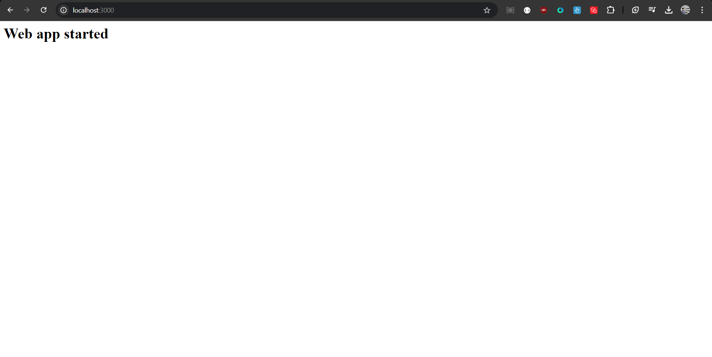

# Steps to run the project
    1. Clone the Github repository
    2. Make sure you have docker
    3. Run docker-compose up --build command in the terminal
    5. The server will be running at the PORT:3000 
    
    6. You will see the above image if access the port from the browser
    